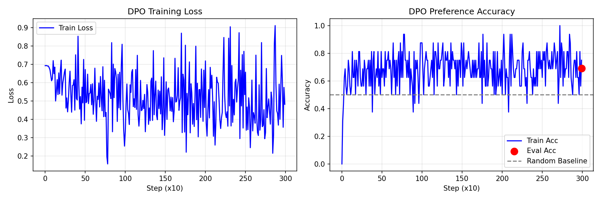

# DPO LoRA Project

A compact, resume-ready implementation of Direct Preference Optimization (DPO) using LoRA adapters on causal LLMs.
It includes dataset loading, a clean training loop, and an LLM-as-judge evaluation script.

## Highlights
- LoRA injection and parameter-efficient fine-tuning
- DPO loss with preference accuracy metrics
- UltraFeedback dataset pipeline
- LLM-as-judge evaluation with position debiasing

## Project Structure
```
.
|-- assets/                 # Figures for README or reports
|-- outputs/                # Training logs and LoRA weights (ignored by git)
|-- scripts/                # Local entrypoints (no install required)
|-- src/dpo_project/        # Package source code
|   |-- cli/                # CLI commands (train/eval/plot)
|   |-- data.py             # Dataset utilities
|   |-- evaluation.py       # LLM-as-judge helpers
|   |-- lora.py             # LoRA layers + utilities
|   |-- losses.py           # DPO loss + log-prob helpers
|   `-- training.py         # Training loop + logging
|-- dpo.py                  # Legacy entrypoint (wrapper)
|-- llm_eval.py             # Legacy entrypoint (wrapper)
|-- plot_training.py        # Legacy entrypoint (wrapper)
|-- pyproject.toml
`-- requirements.txt
```

Note: legacy logs/weights from earlier runs live under `outputs/logs/` and `outputs/weights/`.

## Setup
```bash
python -m venv venv
venv\Scripts\activate
pip install -r requirements.txt
```

Or editable install:
```bash
pip install -e .
```

## Train
```bash
python scripts/train.py \
  --model-name Qwen/Qwen2.5-7B-Instruct \
  --n-samples 50000 \
  --output-dir outputs/qwen2p5-7b
```

## LLM-as-Judge Evaluation
Requires `OPENAI_API_KEY` in your environment or `.env`.
```bash
python scripts/eval_llm_judge.py \
  --lora-path outputs/qwen2p5-7b/lora_weights.pt \
  --output-path outputs/qwen2p5-7b/judge_results.json
```

## Plot Training Curves
```bash
python scripts/plot_training.py \
  --log-path outputs/qwen2p5-7b/training_log.json \
  --out-path assets/training_curves.png
```


